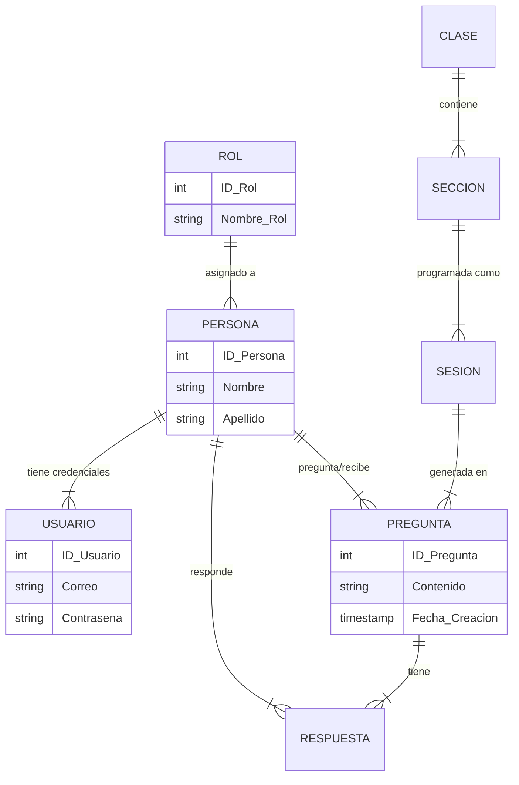

# 🎓 Sistema de Incentivos a la Participación Activa


> Una robusta aplicación de escritorio diseñada para gestionar, rastrear e incentivar la participación estudiantil en entornos académicos mediante un sistema de preguntas y puntos.

---

### 🌐 Idioma / Language
* **[🇺🇸 English Version](README.md)**
* **[🇪🇸 Versión en Español](README.es.md)**

---

## 👨‍💻 Autor
**Creado por Diego Rivera**  
*Senior Software Architect & Developer Experience Expert*

Ver código en GitHub: [https://github.com/dariverap/ProyectoCertificador](https://github.com/dariverap/ProyectoCertificador)

---

## 🚀 Resumen Ejecutivo

Este proyecto aborda la necesidad de un seguimiento dinámico de la interacción en el aula. A diferencia de las hojas de asistencia estáticas, el **Sistema de Participación Activa** permite a los educadores registrar preguntas y respuestas en tiempo real, asignando puntos a los estudiantes según su compromiso. Cuenta con control de acceso basado en roles (Profesores vs. Alumnos), informes visuales mediante gráficos y gestión de sesiones.

## 🏗 Arquitectura y Estructura

El proyecto sigue un patrón **MVC (Modelo-Vista-Controlador)** adaptado para Java Swing.

### 📂 Árbol del Proyecto
```bash
.
├── src/
│   ├── Modelo/          # CAPA DE DATOS: Entidades, DAOs y Conexión DB
│   │   ├── Conexion.java   # Singleton de Conexión JDBC
│   │   ├── LoginDAO.java   # Lógica de Autenticación
│   │   └── [Entidad]DAO.java # Objetos de Acceso a Datos
│   ├── Vista/           # CAPA DE PRESENTACIÓN: Swing JFrames y Formularios
│   │   ├── Login.java      # Interfaz de Autenticación
│   │   └── Sistema.java    # Panel Principal (Dashboard)
│   ├── Reportes/        # REPORTES: Lógica de JFreeChart
│   │   └── Grafico.java    # Generación de Gráficos
│   └── sistema/         # PUNTO DE ENTRADA
│       └── Sistema.java    # Clase Main
├── lib/                 # Dependencias JAR externas
├── bd.sql               # Script del esquema de Base de Datos
└── build.xml            # Script de construcción Ant
```

### 📊 Esquema de Base de Datos (Diagrama ER)

El sistema se basa en una base de datos relacional para vincular usuarios, roles, clases y registros de participación.



---

## 🛠 Stack Tecnológico

*   **Core:** Java JDK 1.8
*   **GUI:** Java Swing (javax.swing)
*   **Sistema de Construcción:** Apache Ant
*   **Base de Datos:** MySQL 8.0
*   **Librerías Clave:**
    *   `mysql-connector-java`: Conectividad a base de datos.
    *   `jfreechart`: Visualización de datos (Gráficos de pastel).
    *   `AbsoluteLayout`: Posicionamiento de formularios.
    *   `itextpdf` y `poi`: Capacidades de exportación.

---

## ⚙️ Instalación y Configuración

### Prerrequisitos
*   Java Development Kit (JDK) 8 o superior.
*   NetBeans IDE (Recomendado) o IntelliJ IDEA.
*   Servidor MySQL ejecutándose en localhost.

### Paso 1: Configuración de Base de Datos
1.  Abre tu cliente MySQL (Workbench, phpMyAdmin, etc.).
2.  Ejecuta el script SQL proporcionado ubicado en `bd.sql`.
3.  Esto creará la base de datos `ParticipacionActiva` e insertará usuarios por defecto.

### Paso 2: Configuración de Conexión
Verifica el archivo `src/Modelo/Conexion.java`. Asegúrate de que las credenciales coincidan con tu entorno local:
```java
// src/Modelo/Conexion.java
private static final String URL = "jdbc:mysql://localhost:3306/ParticipacionActiva?serverTimezone=America/Lima";
// Credencial por defecto en código: user="root", password="admin"
```

### Paso 3: Ejecutar la Aplicación
1.  Clona el repositorio:
    ```bash
    git clone https://github.com/dariverap/ProyectoCertificador.git
    ```
2.  Abre el proyecto en NetBeans.
3.  Resuelve las dependencias JAR (Clic derecho en proyecto -> Resolve Data Problems).
4.  Ejecuta `src/sistema/Sistema.java` (Clase Main) o construye el proyecto.

### 🔐 Credenciales por Defecto
*   **Profesor:** `luis.martinez@example.com` / `password789`
*   **Alumno:** `juan.perez@example.com` / `password123`

---
Copyright © 2024 Diego Rivera. Todos los derechos reservados.
