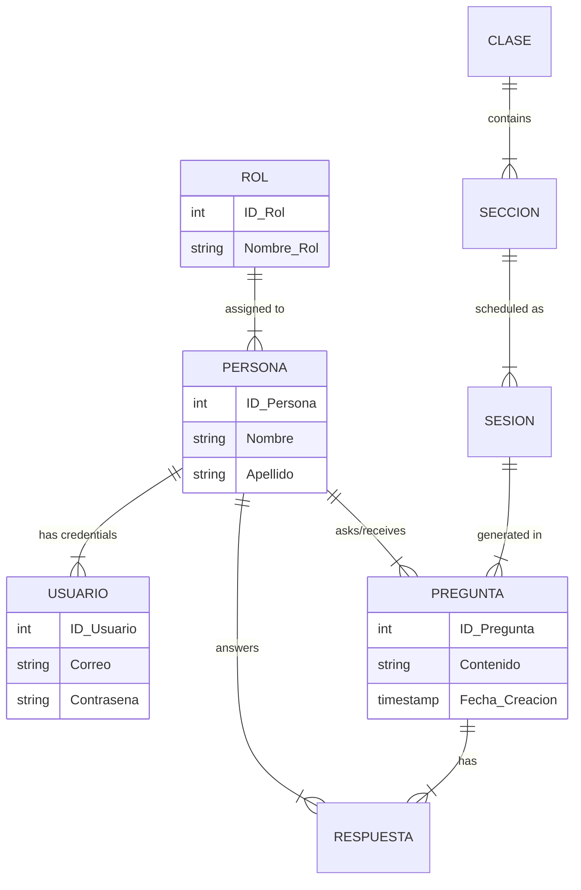

# 🎓 Active Participation Incentive System


> A robust desktop application designed to manage, track, and incentivize student participation in academic environments through a point-based question and answer system.

---

### 🌐 Language / Idioma
* **[🇺🇸 English Version](README.md)**
* **[🇪🇸 Versión en Español](README.es.md)**

---

## 👨‍💻 Author
**Created by Diego Rivera**  
*Senior Software Architect & Developer Experience Expert*

Check out the code on GitHub: [https://github.com/dariverap/ProyectoCertificador](https://github.com/dariverap/ProyectoCertificador)

---

## 🚀 Executive Summary

This project addresses the need for dynamic classroom interaction tracking. Unlike static attendance sheets, the **Active Participation System** allows educators to log real-time questions and answers, assigning points to students based on their engagement. It features role-based access control (Professors vs. Students), visual reporting via charts, and session management.

## 🏗 Architecture & Structure

The project follows a **MVC (Model-View-Controller)** pattern adapted for Java Swing.

### 📂 Project Tree
```bash
.
├── src/
│   ├── Modelo/          # DATA LAYER: Entities, DAOs, and DB Connection
│   │   ├── Conexion.java   # JDBC Connection Singleton
│   │   ├── LoginDAO.java   # Auth Logic
│   │   └── [Entity]DAO.java # Data Access Objects
│   ├── Vista/           # PRESENTATION LAYER: Swing JFrames & Forms
│   │   ├── Login.java      # Auth UI
│   │   └── Sistema.java    # Main Dashboard
│   ├── Reportes/        # REPORTING: JFreeChart Logic
│   │   └── Grafico.java    # Chart Generation
│   └── sistema/         # ENTRY POINT
│       └── Sistema.java    # Main Class
├── lib/                 # External JAR dependencies
├── bd.sql               # Database Schema Script
└── build.xml            # Ant Build Script
```

### 📊 Database Schema (ER Diagram)

The system relies on a relational database to link users, roles, classes, and participation records.



---

## 🛠 Technology Stack

*   **Core:** Java JDK 1.8
*   **GUI:** Java Swing (javax.swing)
*   **Build System:** Apache Ant
*   **Database:** MySQL 8.0
*   **Key Libraries:**
    *   `mysql-connector-java`: Database connectivity.
    *   `jfreechart`: Data visualization (Pie charts).
    *   `AbsoluteLayout`: Form positioning.
    *   `itextpdf` & `poi`: Export capabilities.

---

## ⚙️ Installation & Setup

### Prerequisites
*   Java Development Kit (JDK) 8 or higher.
*   NetBeans IDE (Recommended) or IntelliJ IDEA.
*   MySQL Server running on localhost.

### Step 1: Database Setup
1.  Open your MySQL client (Workbench, phpMyAdmin, etc.).
2.  Execute the provided SQL script located at `bd.sql`.
3.  This will create the database `ParticipacionActiva` and insert default users.

### Step 2: Connection Configuration
Check `src/Modelo/Conexion.java`. Ensure the credentials match your local environment:
```java
// src/Modelo/Conexion.java
private static final String URL = "jdbc:mysql://localhost:3306/ParticipacionActiva?serverTimezone=America/Lima";
// Default credential in code: user="root", password="admin"
```

### Step 3: Running the App
1.  Clone the repository:
    ```bash
    git clone https://github.com/dariverap/ProyectoCertificador.git
    ```
2.  Open the project in NetBeans.
3.  Resolve JAR dependencies (Right-click project -> Resolve Data Problems).
4.  Run `src/sistema/Sistema.java` (Main Class) or build the project.

### 🔐 Default Credentials
*   **Professor:** `luis.martinez@example.com` / `password789`
*   **Student:** `juan.perez@example.com` / `password123`

---
Copyright © 2024 Diego Rivera. All rights reserved.
